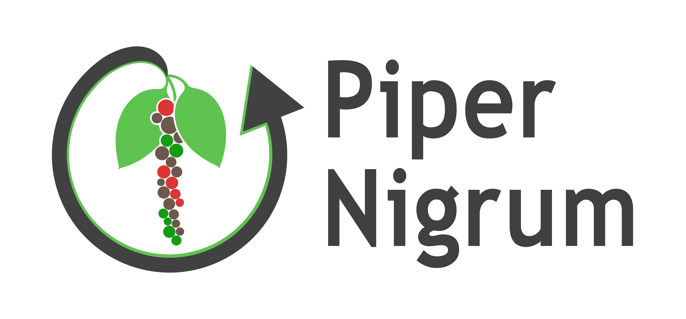
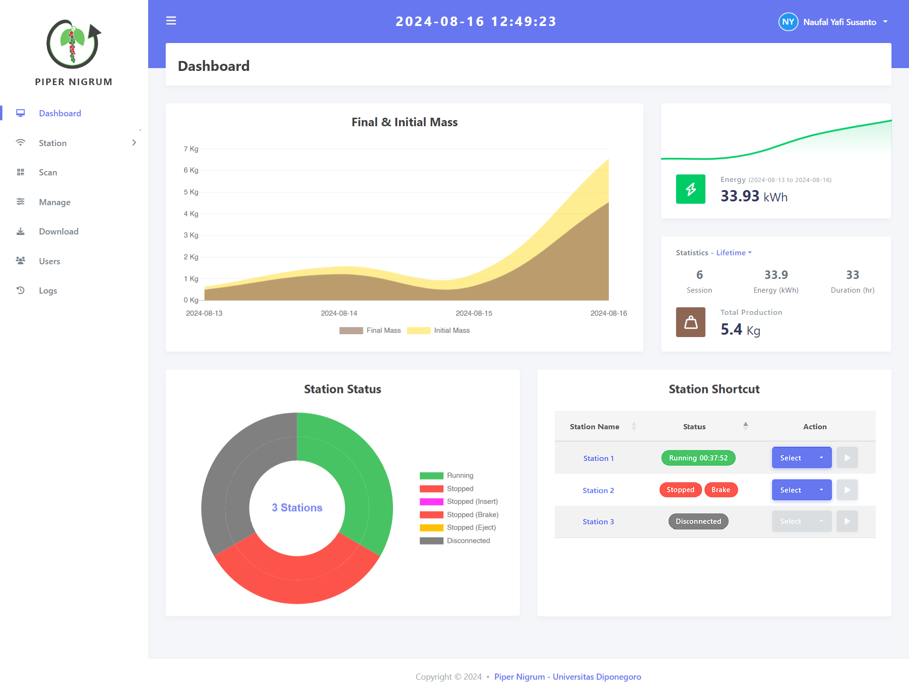
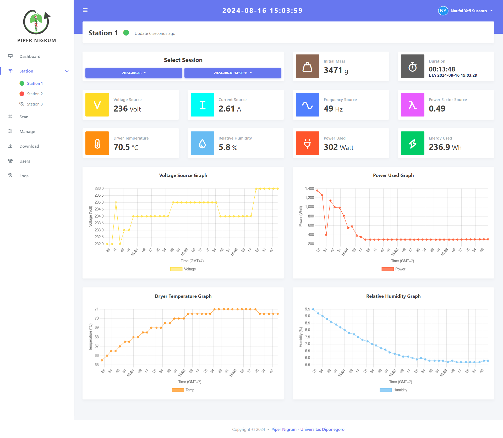
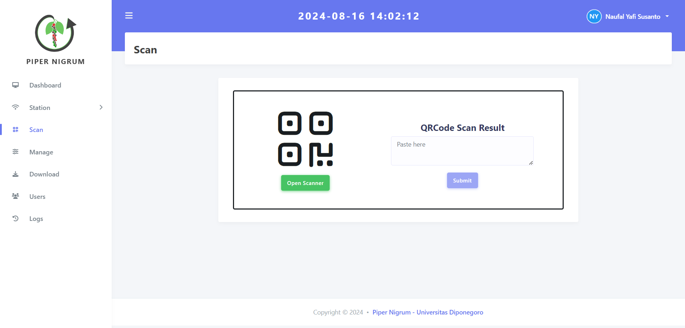
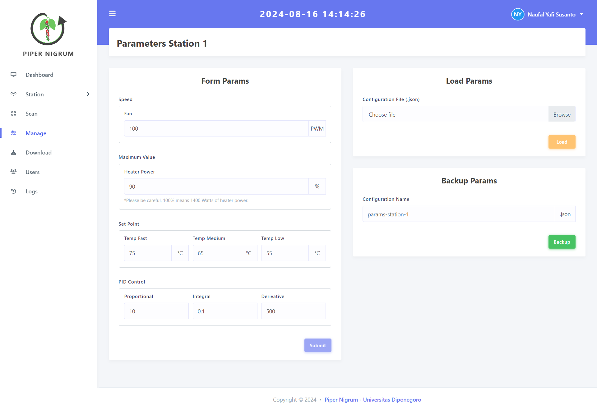
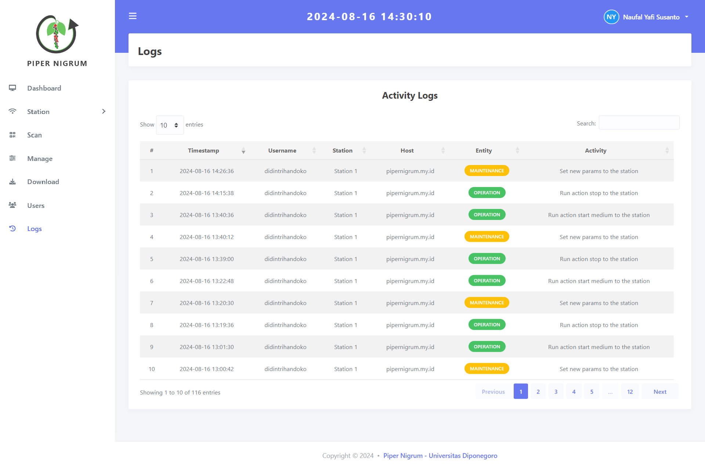

<p align="center">
  
</p>

# Piper Nigrum Monitoring System

A Laravel-based IoT monitoring system for black pepper (*Piper nigrum* L.) rotary dryer, utilizing ESP32 microcontrollers as sensor nodes. The system implements HTTP-based communication between the ESP32 nodes and web server (Laravel) for real-time data transmission and control of the drying equipment, complete with comprehensive logging capabilities.

## Screenshots

<div align="center">
  <div style="display: flex; justify-content: center; gap: 10px; margin-top: 20px;">
    
    
    <br>
    <p><em>Dashboard interface</em></p>
  </div>
</div>

</p>

<p align="center">
  
  <br>
  <em>Station Registration - QR code scanning for new station</em>
</p>

<p align="center">
  
  <br>
  <em>Parameter Settings - Configure rotary dryer operation parameters</em>
</p>

<p align="center">
  
  <br>
  <em>System Logs - Track all system activities and operations</em>
</p>

## System Architecture

### Hardware Components
- **Controller**: 
  - ESP32 for wireless communication and control
  - Arduino Nano for additional control functions
- **Sensors**:
  - PZEM-004T: Power monitoring (voltage, current, power factor, frequency)
  - HTU21D: Environmental monitoring
  - DS18B20: Temperature monitoring
  - TFT: Display interface
- **Actuators**:
  - Stepper motor
  - Fans
  - Relay controls
  - Dimmer
  - Heater

### Server Infrastructure
- **Server Hardware**: Raspberry Pi 4B
- **Network Configuration**:
  - Local network access via mDNS
  - Public access via secure tunnel
- **Components**:
  - Web Server (Laravel)
  - MySQL Database
  - DHCP Server
  - RTC for time synchronization
  - SSR for access point control

### Communication
- **Protocol**: HTTP-based data transmission
- **Network**:
  - Wireless connection between ESP32 and server
  - Ethernet connection for access point
- **Data Flow**:
  - Real-time sensor data transmission to server
  - Command transmission to control dryer operations
  - Database storage and retrieval

## Features

### Core Features
- **Real-time Monitoring**:
  - Mass measurement
  - Duration tracking
  - Power metrics (voltage, current, frequency, power factor)
  - Temperature and relative humidity
  - Power consumption and energy usage

### Control Features
- **Equipment Control**:
  - Fan speed adjustment
  - Heater power control
  - Temperature setpoint configuration
  - PID constants tuning
  - Start/stop operation control

### Management Features
- **Station Management**:
  - QR code-based station registration
  - Station removal capability
- **User Management**:
  - User account administration
  - Profile settings management

### Additional Features
- **Dashboard**: Production summary and energy usage statistics
- **Data Export**: Download capability for database records
- **Activity Logging**: Comprehensive operation history
- **Cross-platform Compatibility**: Works on PC, tablet, and mobile devices
- **Remote Access**: Accessible anywhere with internet connection


## Tech Stack

### Server Side
- **Framework**: Laravel 10.x
- **PHP Version**: 8.1 or higher
- **Database**: MySQL
- **Server**: Raspberry Pi 4B running web and DHCP services
- **Frontend**: Stisla Admin Template with Laravel Blade and Bootstrap

### IoT Hardware
- **Microcontrollers**:
  - ESP32 for wireless communication
  - Arduino Nano for control functions
- **Sensors**:
  - PZEM-004T for power monitoring
  - HTU21D for environmental parameters
  - DS18B20 for temperature
  - TFT display module

### Network
- **Local Access**: Via DNSMasq for local network discovery
- **Remote Access**: Via Cloudflare Tunnel for internet access
- **Protocol**: HTTP-based communication

### Development Tools
- **Version Control**: Git
- **Debugging**: Clockwork
- **Data Export**: Box/Spout for spreadsheet generation

## Installation

1. Clone the repository:
```bash
git clone [repository-url]
```

2. Install PHP dependencies:
```bash
composer install
```

3. Copy environment file:
```bash
cp .env.example .env
```

4. Configure your environment variables in `.env`:
   - Database connection
   - AWS credentials for cloud services
   - Ably API key for real-time updates
   - Other IoT-specific configurations

5. Generate application key:
```bash
php artisan key:generate
```

6. Run database migrations:
```bash
php artisan migrate
```

## Development

Start the development server:
```bash
php artisan serve
```

## Station Setup

1. Each pepper dryer station should be configured with:
   - Unique station ID
   - Network connectivity settings
   - Sensor calibration parameters
   - Alert thresholds

2. Ensure the station's IoT devices are properly connected and sending data to the monitoring system

## Monitoring Features

- Real-time temperature monitoring of black pepper drying process
- Humidity level tracking for optimal drying conditions
- Drying process status and progress tracking
- Alert system for critical conditions
- Historical data logging and analysis
- Performance analytics and reporting
- Beautiful and responsive dashboard using Stisla Admin Template
